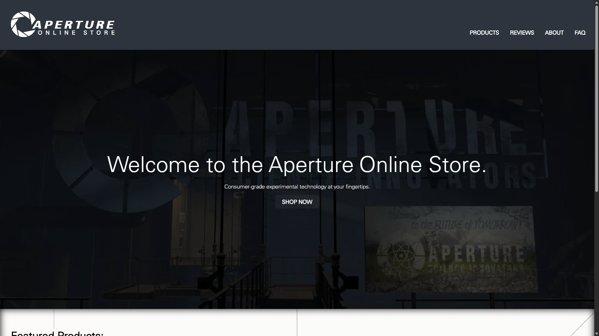
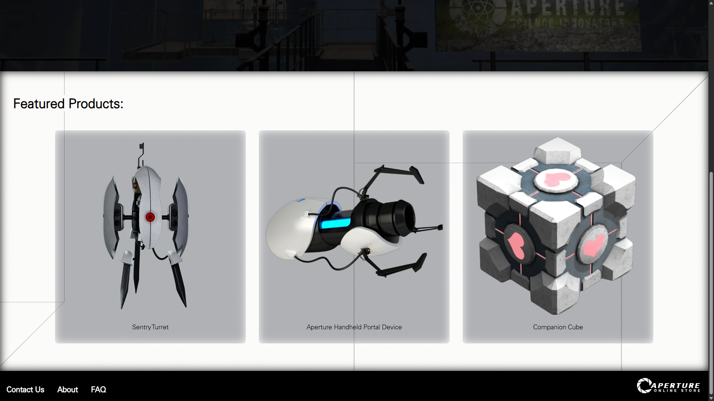
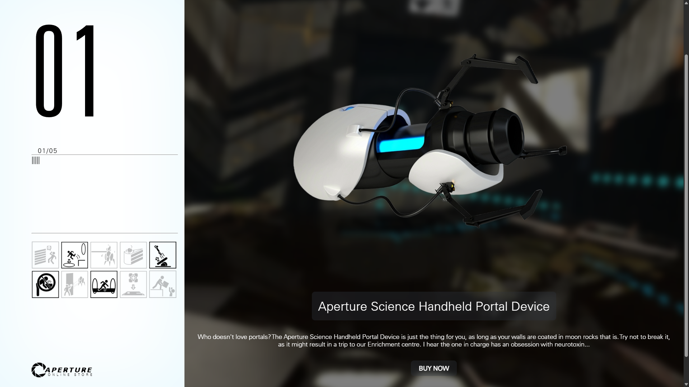
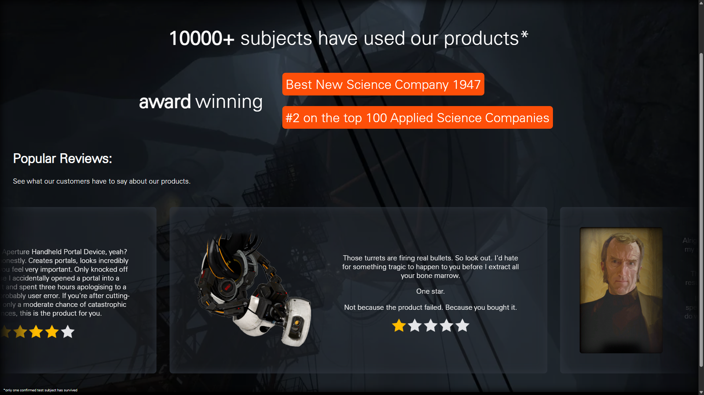
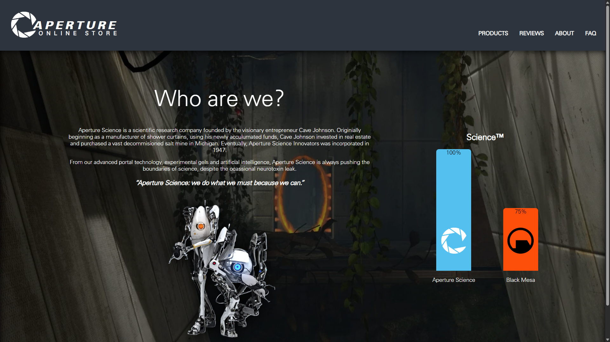
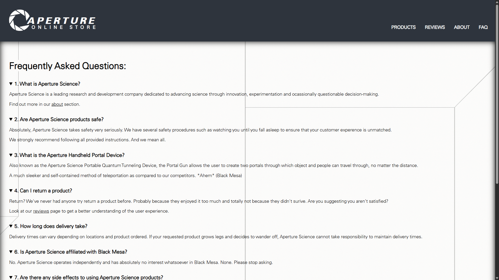

# Aperture Online Store

*A fictional website that sells items from the Portal franchise as if they were real products.*

## Preview Screenshots

## How did I come up with this project?

At school I was tasked with creating a simple website design, and due to my love for the Portal franchise and the various advertisements that Valve has put out such as the Portal investment opportunity series of videos, I thought is would be fun to create a website where products from the Portal franchise are sold as if they were real products.

I had a lot of fun using dialogue snippets and various other forms of media to round out parts of the website making it feel like it could be something that your might actually see in universe.

Although the project started off as just one page, I decided to expand upon it for the Stardance challenge, demonstrating website design, HTML, CSS and JavaScript development.

## Features:

- Responsive design for desktop, tablet and mobile
- Product catalogue
- Individual product pages
- Product reviews
- FAQ section
- Hamburger navigation for mobile
- Interactive product popups
- Custom Portal-themed cursor
- Hover animations

## Design

The website was designed around the visual style of Aperture Science. My favourite part is probably on the product pages where I attempted to recreate the test chamber signs to number each item.

From the cursor to the typography and colour palette, I tried my best to use what references I could find online to stay as true to the original as possible.

Learning responsive design was probably the most important part for me, because before that I was used to creating websites which were intended for a desktop user, which means that even if the window was resized, everything went out of alignment.

## Pages

- Home: contains the hero section and some featured products
- Products: has a grid layout showing all of the available products making it easy to add more if necessary
- Individual Product Pages:
  - Handheld Portal Device
  - Long Fall Boots
  - Sentry Turret
  - Companion Cube
  - Aperture Science Signature Cake
- Reviews: has popular reviews from your favourite Portal characters
- About: description of Aperture Science and its history
- FAQ: frequently asked questions with a little bit of humour

## Challenges and Improvements

During development, there were many problems. You know how it is, aligning anything is always a pain but I made sure to work through it, maintaining consistency throughout the website.

Progressively I adapted the original design to smaller screens. The iPad Mini's screen size was giving me headaches.

I think in the future, maybe adding a checkout page and such, since at the moment I have just added a popup that says all the products are unavailable. (I have no intention of actually selling a Portal Gun)

## Credits

This project is a fan-made, non-commercial website inspired by Valve's Portal series.

Portal and its associated characters, imagery and intellectual property belong to Valve Corporation.

This project is not affiliated with or endorsed by Valve.

### Resources

[Useful Reddit post with various Portal fonts](https://www.reddit.com/r/Portal/comments/j0l6au/my_collection_of_portal_2_fonts_obviously_not_all/?solution=e1e585e06bc3f539e1e585e06bc3f539&js_challenge=1&token=7afd7253fec22262ff1c52b1703fe9eceae0fff9b80ba837b317fc8f8c090b77&jsc_orig_r=)

[Follow up post with font names](https://www.reddit.com/r/Portal/comments/j0t1ci/as_a_follow_up_to_my_portal_2_font_wall_heres_the/?solution=079a3538a0257f49079a3538a0257f49&js_challenge=1&token=7afd7253fec22262ff1c52b1703fe9ecba48ef6f779606e780132245c2402a3b&jsc_orig_r=)

[High quality screenshots from Portal 2](https://www.reddit.com/r/Portal/comments/1nhbq8c/hires_background_screenshots/#lightbox)

[Portal-themed cursor](https://www.rw-designer.com/cursor-set/portal2crosshair#google_vignette)

[Test Chamber Icons](https://theportalwiki.com/wiki/Category:Chamber_info_icons)
